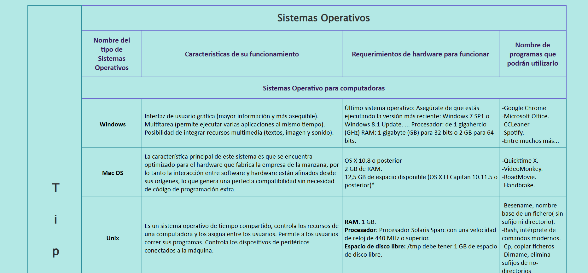
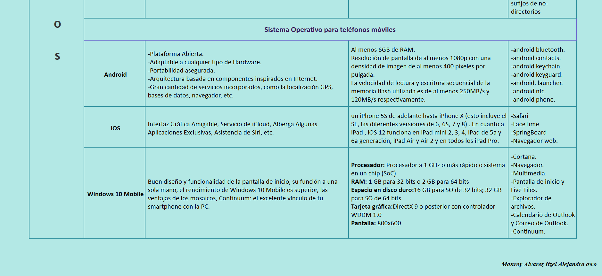

# SO-con-tablas

Página web hecha con **HTML** y **CSS** sobre **Sistemas Operativos (SO)** utilizando **tablas** para organizar la información.

---

## Tabla de contenidos
- [Descripción](#descripción)
- [Tecnologías utilizadas](#tecnologías-utilizadas)
- [Estructura del proyecto](#estructura-del-proyecto)
- [Cómo ver el proyecto](#cómo-ver-el-proyecto)
- [Sección de imágenes (evidencias)](#sección-de-imágenes-evidencias)
- [Notas](#notas)

---

## Descripción
Este proyecto presenta contenido relacionado con **Sistemas Operativos**, maquetado en una página web donde la información se organiza principalmente mediante **tablas**.

---

## Tecnologías utilizadas
- **HTML**: estructura del contenido (archivo principal: `owo.html`)
- **CSS**: estilos y diseño (archivo: `owo.css`)

---

## Estructura del proyecto
Archivos principales del repositorio:

- `owo.html` → Página principal (estructura en HTML)
- `owo.css` → Hoja de estilos (CSS)
- `images/` → Carpeta con imágenes/evidencias del proyecto
- `README.md` → Documentación del proyecto

---

## Cómo ver el proyecto
### Opción 1: abrir localmente
1. Descarga o clona el repositorio.
2. Abre el archivo `owo.html` en tu navegador.

### Opción 2 (recomendada): usar Live Server (VS Code)
1. Abre la carpeta del proyecto en VS Code.
2. Instala la extensión **Live Server**.
3. Click derecho en `owo.html` → **Open with Live Server**.

---

## Sección de imágenes (evidencias)
Evidencias incluidas en la carpeta `images/`:

### Evidencia 1

### Evidencia 2

